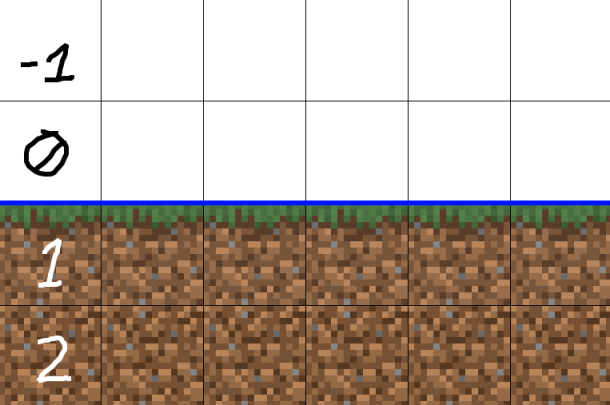
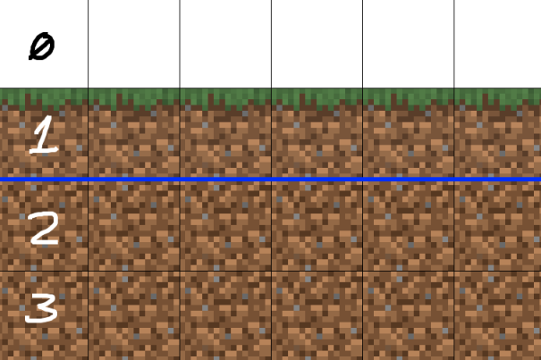

- How terrain generates comes from the [[Chunk Generator]]. Currently there is just the `NOISE_3D` chunk generator which is provided by the `chunk-generator-noise-3d` [[Core Addon]], so this page will focus on working with that.
- {{embed [[Chunk Generator]]}}
- The chunk generator should already be set if you're working with a pack that can load, setting it in your [[Pack Manifest]] should look like this:
  ```yaml
  id: MY_CONFIG_PACK
  ...
  generator: NOISE_3D
  ...
  ```
- `NOISE_3D` requires you to configure terrain shape per [[Biome Config]].
- ## Typical terrain configs
- Earth-like terrain (as opposed to more fantastical things like floating islands) can be configured using the following structure (which goes inside a [[Biome Config]]):
- ```yaml
  terrain:
    sampler:
      type: EXPRESSION
      expression: -y + base
      variables:
        base: 64 # Base y level of the terrain
    sampler-2d:
      type: EXPRESSION
      expression: heightmap(x, z) * height
      variables:
        height: 100 # The height of the terrain
      samplers:
        heightmap:
          dimensions: 2
          type: PROBABILITY
          sampler:
            # The noise sampler that acts as the heightmap
            # This is what you will want to modify to change the shape of the terrain
            type: OPEN_SIMPLEX_2
            frequency: 0.01
  ```
- It is highly recommended to put this inside an [[Abstract Config]] and use [[Config Inheritance]] like so:
  ```yaml
  id: TERRAIN_SIMPLE
  type: BIOME
  abstract: true
  
  terrain:
    sampler:
      type: EXPRESSION
      expression: -y + base
      variables:
        base: 64 # Base y level of the terrain
    sampler-2d:
      type: EXPRESSION
      expression: heightmap(x, z) * height
      variables:
        height: 100 # The height of the terrain
      samplers:
        heightmap:
          dimensions: 2
          type: PROBABILITY
          sampler:
            # The noise sampler that acts as the heightmap
            # This is what you will want to modify to change the shape of the terrain
            type: OPEN_SIMPLEX_2
            frequency: 0.01
  ```
- Then in a [[Biome Config]] , use the `extends` [[config parameter]] to make use of the configured terrain in the biome:
  ```yaml
  id: MY_COOL_BIOME
  type: BIOME
  extends:
    - TERRAIN_SIMPLE # Use the terrain configured in TERRAIN_SIMPLE
  ...
  ```
- You can make several copies of `TERRAIN_SIMPLE` for different unique terrain shapes. For example you might have a `TERRAIN_MOUNTAINS` or `TERRAIN_PLAINS` from which each biome config can choose from.
- Another tip is to make use of [YAML anchors](http://terra.polydev.org/config/development/config-data.html#yaml-anchors) to make things a little neater. Here is an example of the config from above modified to use them:
  ```yaml
  id: TERRAIN_SIMPLE
  type: BIOME
  abstract: true
  
  variables: &variables
    base: 64 # Base y level of the terrain
    height: 100 # The height of the terrain
  
  heightmap: &heightmap
    type: OPEN_SIMPLEX_2
    frequency: 0.01
  
  terrain:
    sampler:
      type: EXPRESSION
      expression: -y + base
      variables: *variables
    sampler-2d:
      type: EXPRESSION
      expression: heightmap(x, z) * height
      variables: *variables
      samplers:
        heightmap:
          dimensions: 2
          type: PROBABILITY
          sampler: *heightmap
  ```
-
- ## How the terrain parameters control terrain shaping
- Here we will explain how to build up a config such as the provided example above, as well as explain why it works the way it does.
- `NOISE_3D` requires each [[Biome Config]] to specify how the terrain should be shaped. This is configured via the `terrain.sampler` [[config parameter]], which is a 3D [[Noise Sampler]], and must be defined for a biome config for it to be valid.
- Here is the skeleton of a config with `terrain.sampler` defined:
  ```yaml
  id: COOL_BIOME
  type: BIOME
  ...
  terrain:
    sampler:
      # 3D noise sampler goes here
  ```
- Each block can either be 'solid' or 'air'. The *simplified process* of how a block is determined to be either solid or air is as follows:
- The position of the block is sampled by the block's biome's `terrain.sampler`. The value of this sample is considered the block's 'density'.
  logseq.order-list-type:: number
- If the block's density is greater than 0 (i.e. any positive number), then it is considered solid, and if not (i.e. any negative number and zero), it is considered air.
  logseq.order-list-type:: number
- logseq.order-list-type:: number
- Based on this, we can make every block solid in a biome by using a [[Noise Sampler]] which always outputs a positive number:
  ```yaml
  # Set every block to solid
  terrain:
    sampler: # This noise sampler always outputs a constant value of 1
      type: CONSTANT
      value: 1
  ```
- Alternatively we could make every block air in a biome by using a negative value or 0:
  ```yaml
  # Set every block to air
  terrain:
    sampler:
      type: CONSTANT
      value: -1
  ```
- Try out some of the samplers listed [here](http://terra.polydev.org/config/documentation/sampler/index.html) and see what results you get. Below are some examples. Try and figure out why they produce the results they do:
- ```yaml
  terrain:
    sampler:
      type: OPEN_SIMPLEX_2
  ```\
- ```yaml
  terrain:
    sampler:
      type: FBM
      sampler:
        type: OPEN_SIMPLEX_2
  ```
- ```yaml
  terrain:
    sampler:
      type: WHITE_NOISE
  ```
- To create flat terrain we will need to:
	- Produce positive values (=solid) *below* a certain y level
	- Produce negative values (=air) *above* that y level
- The simplest way to do this is by outputting the negative y level, resulting in positive values below y=0, and negative values above y=0.
- This can be done using the [[EXPRESSION]] [[Noise Sampler]] like so:
  ```yaml
  terrain:
    sampler:
      type: EXPRESSION
      expression: -y
  ```
  
  Here is a visual for the density at each y level:
  {:height 248, :width 356}
- If we then add 1 to the density, we will in effect shift the terrain upwards by 1 block:
  ```yaml
  terrain:
    sampler:
      type: EXPRESSION
      expression: -y + 1
  ```
  
  Here is the same set of block positions, note that each number from the previous example has +1 added to it, and therefore the terrain has shifted above the blue line by 1 block.
  {:height 248, :width 356}
- Based on this, we can deduce that the number added to `-y` will correspond to the height of the terrain. For example for flat terrain at y=64, you could use this:
  ```yaml
  terrain:
    sampler:
      type: EXPRESSION
      expression: -y + 64
  ```
- We can make a general formula `-y + h` where `h` = terrain height.
- ### Adding height variation
- Based on this, we can create some more interesting looking terrain. Let's use some [sine waves](https://en.wikipedia.org/wiki/Sine_wave) for example:
  ```yaml
  terrain:
    sampler:
      type: EXPRESSION
      expression: -y + sin(x)
  ```
- This isn't all too interesting just yet, the `sin(x)` function outputs values in the range [-1, 1], so we will only get small rises up and down by 1 block along the x axis. To make this more dramatic, the output of `sin(x)` can be multiplied by a value (we will call this the 'height') to make those peaks and valleys higher / lower (resulting in a range of [-height, height]):
  ```yaml
  terrain:
    sampler:
      type: EXPRESSION
      expression: -y + sin(x) * height
      variables:
        height: 30
  ```
- You will get some peaks and valleys very close together using this, to spread them out more we can multiply the x coordinate by a small number (let's call this 'frequency'):
  ```yaml
  terrain:
    sampler:
      type: EXPRESSION
      expression: -y + sin(x * frequency) * height
      variables:
        height: 30
        frequency: 0.05
  ```
- This can be visualized using a graphing calculator, [here is a visualization in desmos](https://www.desmos.com/calculator/r1lgf72byc). Have a play around with the sliders and see how they affect the terrain.
- {{embed [[Using Images For Terrain]]}}