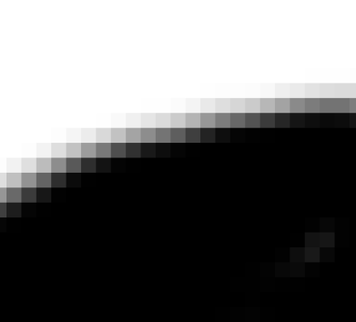
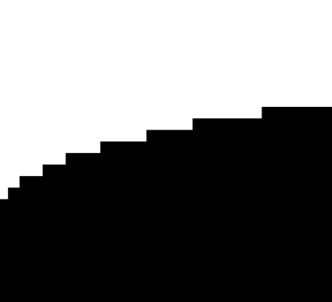
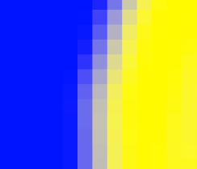
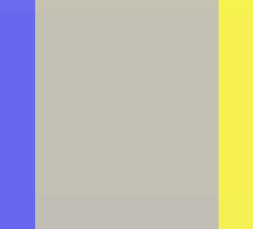

- Base image related functionality is introduced by the `library-image` [[Addon]], [add that as a dependency](How to add an addon as a dependency) to get started working with images.
- You can find the official documentation for image related functionality [here](https://terra.polydev.org/config/documentation/image/index.html).
- ## Distributing biomes using an image
- ### Image Biome Provider
- The most basic method of distributing biomes via image(s) is by utilizing the `IMAGE` [[Biome Provider]] which is implemented by the `biome-provider-image-v2` [[Addon]]. Make sure you [add that as a dependency](How to add an addon as a dependency) before continuing.
- If your pack already uses the legacy `biome-provider-image` addon, make sure to remove it as a dependency, otherwise you will get a conflict for the `IMAGE` type which both addons use!
- {{embed [[Biome Provider]]}}
- Set the `type` key to `IMAGE`.
- The skeleton of the image biome provider looks like so:
  ```yaml
  id: MY_CONFIG_PACK
  
  ...
  
  biomes:
    type: IMAGE
    
    color-sampler:
      ...
     
    color-conversion:
      ...
  
  ...
  ```
	- `color-sampler` - a [[Color Sampler]] config.
	- `color-conversion` - A [[Color Converter]] that maps colors to biomes.
- Example config:
  ```yaml
  id: MY_CONFIG_PACK
  
  ...
  
  biomes:
    type: IMAGE
    color-sampler:
      type: SINGLE_IMAGE # Only gen a single image rather tiling
      align: CENTER # Makes center of image at 0,0
      image:
        type: BITMAP
        path: images/biome.png
      outside-sampler: # What to use outside the image
        type: COLOR
        color: "#0000FF" # Use blue for area outside the image
    color-conversion:
      type: CLOSEST # Pick the biome based on the most similar color in the image
      match:
        type: USE_BIOME_COLORS # Use the 'color' key in biome configs
                               # as each biome's color
        
  ...
  ```
- Modified example that moves where the center of the image is:
  ```yaml
  id: MY_CONFIG_PACK
  
  ...
  
  biomes:
    type: IMAGE
    color-sampler:
      type: TRANSLATE # Translates an image sampler center to 500,-500
      x: 500
      y: -500
      color-sampler: # Color sampler to be translated
        type: SINGLE_IMAGE # Only gen a single image rather tiling
        align: CENTER # Makes center of image at 0,0
        image:
          type: BITMAP
          path: images/biome.png
        outside-sampler: # What to use outside the image
          type: COLOR
          color: "#0000FF" # Use blue for area outside the image
    color-conversion:
      type: CLOSEST # Pick the biome based on the most similar color in the image
      match:
        type: USE_BIOME_COLORS # Use the 'color' key in biome configs
                               # as each biome's color
        
  ...
  ```
- Another modified example that uses a manually defined biome color mapping:
  ```yaml
  id: MY_CONFIG_PACK
  
  ...
  
  biomes:
    type: IMAGE
    color-sampler:
      type: SINGLE_IMAGE # Only gen a single image rather tiling
      align: CENTER # Makes center of image at 0,0
      image:
        type: BITMAP
        path: images/biome.png
      outside-sampler: # What to use outside the image
        type: COLOR
        color: "#0000FF" # Use blue for area outside the image
    color-conversion:
      type: CLOSEST # Pick the biome based on the most similar color in the image
      match:
        type: MAP
        map:
          "#00FF00": PLAINS # Green pixels will map to plains
          "#FF0000": DESERT # Red pixels will map to desert
          "#0000FF": OCEAN # Blue pixels will map to ocean, since this is the 
                           # same as the color the 'outside-sampler' produces,
                           # everywhere outside the image will be ocean.
  
  ...
  ```
- ### Image Pipeline Source
- The `IMAGE` [[Pipeline Source]] is provided by the `pipeline-image` [[Addon]]. It is defined under the `source` key of a [[Pipeline Biome Provider]], and is configured the same as the image biome provider with the addition of being able to utilize [[Placeholder Biome]]s in addition to regular biome IDs.
- ### Anti-aliasing in images
- When using images to distribute discrete items such as biomes (as opposed to continuous things like heightmaps), any kind of anti-aliasing could be interpreted as an unexpected biome, so you do not want any kind of smoothing, shadows, blending etc in your image.
- For example, every grey pixel between the white and black areas could be interpreted as a completely different unintended biome:
	- {:height 150, :width 150}
- Instead you want hard lines like this:
	- {:height 150, :width 150}
- In a case like this you might want an ocean next to a desert:
	- {:height 150, :width 150}
- but zooming in and looking at the actual pixel color between the two, it could end up matching something like a snowy biome which has been configured to use a grey color, and then you end up unintentionally sandwiching a snowy biome between your desert and ocean:
	- {:height 150, :width 150}
- ## Using images to generate noise
- Images can be used to provide values where [[Noise Sampler]]s are used.
- The `CHANNEL` [[Noise Sampler]] lets you map the channels of colors produced by a [[Color Sampler]] to noise values.
- Here is an example of the `CHANNEL` [[Noise Sampler]]:
  ```yaml
  type: CHANNEL
  channel: GRAYSCALE # Other options are RED, GREEN, BLUE, and ALPHA
  color-sampler:
    type: SINGLE_IMAGE # Only gen a single image rather tiling
    align: CENTER # Makes center of image at 0,0
    image:
      type: BITMAP
      path: images/myimage.png
    outside-sampler: # What to use outside the image
      type: COLOR
      color: "#000000" # Use black for area outside the image
  ```
- {{embed [[Using Images For Terrain]]}}